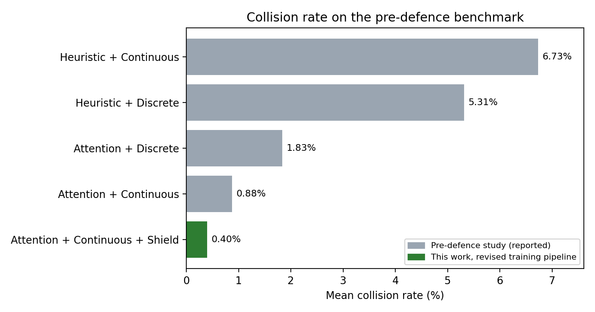
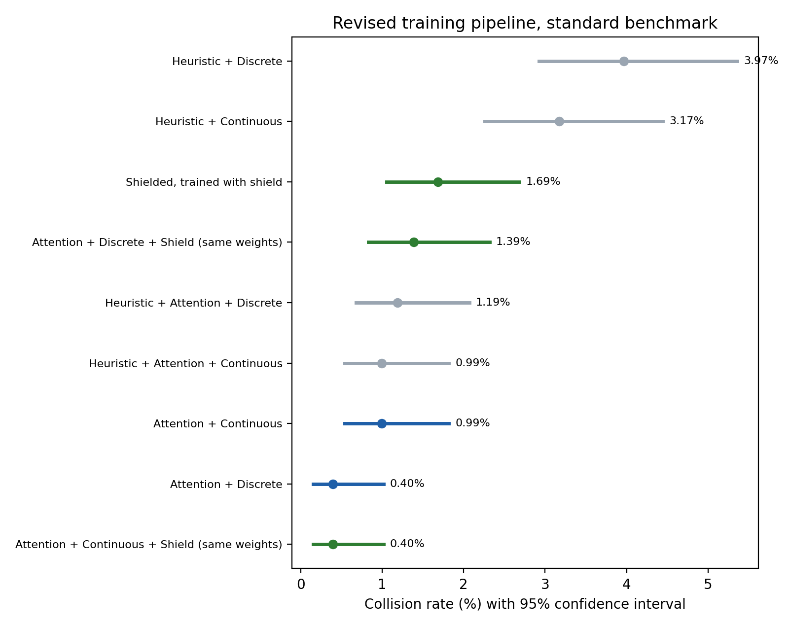

# Shielded PPO Extension — Results Report

**Author:** Muntasir Hossain (210041265)
**Thesis:** Navigating Unsignalised Intersections in Frenet Space with PPO and Attention (CSE 4700, IUT)
**Scope:** Section 11.2 of the pre-defence report, *Shielded PPO Extension*

Complete numeric tables with confidence intervals and significance tests are in
[`results_tables.md`](results_tables.md), regenerated from the raw evaluation files by
`scripts/make_report.py`.

---

## 1. Summary

1. **A three-layer post-decision safety shield was implemented** on top of the
   attention-based PPO controller: path-based time-to-conflict braking, an RSS safe-distance
   override, and a right-before-left yielding rule. Every intervention is counted per layer.

2. **In the pre-defence environment, used for both training and evaluation, the shield
   significantly increased collisions.** Without the shield the controller collided in 6.35%
   of episodes. With the shield it was 9.72% (p = 0.007), and with the rear-aware variant 9.42%
   (p = 0.013). Background vehicles in that environment do not brake, so shield braking causes
   rear-end collisions, and capping the braking trades those for crossing conflicts
   (Section 3.6).

3. **On the pre-defence benchmark, with the revised training pipeline, the shielded controller
   recorded 0.40% collisions**, below every controller reported in the pre-defence study (best:
   Attention + Continuous, 0.88%). Applied to identical policy weights, the shield reduced
   collisions from 0.99% to 0.40%, which is **not statistically significant** (p = 0.18), and
   the reduction did not hold under high-flow traffic. In the same pipeline Attention + Discrete
   also reached 0.40%.

4. **The shield costs efficiency in every setting.** On the benchmark, travel time rose from
   12.9 s to 16.3 s. In the pre-defence environment it rose from 21.5 s to 26.7 s and success
   rate fell from 92.1% to 85.7%. The RSS layer produced most interventions.

5. **Attention-based control clearly outperforms heuristic control** (p < 0.001), confirming
   the central finding of the pre-defence study with 8,000+ new evaluation episodes.

6. **Conclusion for Section 11.2.** A braking-only post-decision shield did not improve safety
   for this attention-based PPO controller. It helped slightly and not significantly in the
   benign benchmark, and it harmed significantly in the aggressive pre-defence environment,
   where the policy learned to keep moving through traffic that does not yield. This points to
   shield-aware training, in which the policy learns with the shield active, as the next step.

---

## 2. Environment

### 2.1 Evaluation environment: identical to the pre-defence study

All results are measured with the pre-defence evaluation protocol from
`src/test/v0_1_evaluate.py`:

| Setting | Value |
|---|---|
| Network | `100m_right_before_left.net.xml`, 4-way unsignalised junction |
| Traffic scenarios | Sc1–Sc6 at 150 / 275 / 400 veh/h, same compositions |
| Intention settings | All straight, all left, uniform random, asymmetric random |
| Episodes per configuration | 42 (1,008 per controller) |
| Background vehicles | IDM, `speed_mode` 31 |
| RL vehicle spawn probability | 0.8 |
| Policy at evaluation | Deterministic |
| Simulation | `sim_step` 0.25 s, horizon 180 |

### 2.2 Training environment

The models in Sections 3.2–3.5 were trained in a revised pipeline whose training
environment differs from the pre-defence training script, `src/configs/v0_1_single_agent.py`:

| Training setting | Pre-defence | Revised pipeline |
|---|---|---|
| Cross traffic | 400 veh/h (N, S, E) | 275 veh/h |
| Background traffic in the agent's lane | 275 veh/h | none |
| Background vehicle `speed_mode` | 0 | 31 |
| RL spawn probability | 0.3 | 0.8 |
| Environment warmup | 5 steps | 50 steps |
| PPO hyperparameters, 1.5M steps, 8 workers | — | identical |

The revised pipeline therefore trains on an easier task.

### 2.3 Pre-defence environment for training and evaluation

To remove this difference, Attention + Continuous was **retrained in the pre-defence training
environment** (`--train-profile ibrahima`) and **evaluated in that same environment**
(`--eval-profile ibrahima`), with the shield off, on, and in a rear-aware variant. For these
results, training and evaluation use the same environment as the pre-defence study:
400 veh/h cross traffic, 275 veh/h background traffic in the agent's lane, background vehicles
that ignore SUMO safety checks, RL spawn probability 0.3 and a 5-step warmup.

Two implementation details differ. The observation includes three leader features (gap,
leader speed, leader TTC) added after the pre-defence report. Training used 24 parallel
workers with a 341-step rollout, keeping the batch at 8,184 samples (8,192 in the original).

These results are written automatically to **Section D of
[`results_tables.md`](results_tables.md)** as each run completes.

A controller trained in the revised pipeline does not transfer to this environment: in a
6-episode check it collided in 3 of 6 episodes without the shield and 5 of 6 with it,
because background vehicles that ignore safety checks rear-end a vehicle the shield slows
down. This motivated the rear-aware variant, whose settings (1.5 s follower time gap,
braking capped at −1.0 m/s²) were fixed before evaluation.

---

## 3. Results

### 3.1 Comparison with the pre-defence study



| Rank | Controller | Mean collision rate | Source |
|---|---|---|---|
| 1 | Heuristic + Continuous | 6.73% | Pre-defence report, Figure 9.2 |
| 2 | Heuristic + Discrete | 5.31% | Pre-defence report, Figure 9.2 |
| 3 | Attention + Discrete | 1.83% | Pre-defence report, Figure 9.2 |
| 4 | Attention + Continuous | 0.88% | Pre-defence report, Figure 9.2 |
| 5 | **Attention + Continuous + Shield** | **0.40%** | This work |

Per scenario, the shielded controller was lower than the pre-defence Attention + Continuous
result in four of six scenarios. The baselines are the values reported in the pre-defence
study; the shielded controller was evaluated on the same benchmark but trained in the revised
pipeline (Section 2.2). The difference from 0.88% is not statistically significant
(approximately 9 vs 4 collisions, p ≈ 0.27).

### 3.2 Controlled shield evaluation

To isolate the shield, the same trained Attention + Continuous policy was evaluated with the
shield off and on.

| | Shield off | Shield on | Change |
|---|---|---|---|
| Collision rate | 0.99% | **0.40%** | −60% |
| Success rate | 99.0% | 97.0% | −2.0 pts |
| Travel time | 12.9 s | 16.3 s | +3.4 s |
| Waiting time | 0.11 s | 2.99 s | +2.9 s |
| Actions overridden | — | 18.5% | |

10 vs 4 collisions, p = 0.18.

Override breakdown: TTC 1,352 · RSS 13,399 · right-of-way 17.

### 3.3 All controllers, revised pipeline



| Controller | Collision rate | 95% CI |
|---|---|---|
| Heuristic + Discrete | 3.97% | 2.93–5.36% |
| Heuristic + Continuous | 3.17% | 2.26–4.45% |
| Attention + Continuous | 0.99% | 0.54–1.82% |
| Attention + Discrete | 0.40% | 0.15–1.02% |
| Attention + Continuous + Shield | 0.40% | 0.15–1.02% |

The results form two tiers. Heuristic controllers are significantly worse than attention
controllers (p < 0.001). The three attention-based controllers are **statistically
indistinguishable** from one another (all pairwise p ≥ 0.17), so no ranking within that tier
is claimed.

### 3.4 High-flow traffic

The attention controllers were also evaluated at 550, 700 and 850 veh/h per approach, with
identical traffic across controllers.

| Controller | Collision rate |
|---|---|
| Heuristic + Discrete | 3.97% |
| Heuristic + Continuous | 3.77% |
| Attention + Continuous | 0.60% |
| Attention + Discrete | 0.40% |
| Attention + Continuous + Shield | 1.39% |
| Attention + Continuous + Shield + commit zone | 1.19% |

Under high flow the shield did not reduce collisions (3 vs 7, p = 0.34). Across both traffic
conditions combined the shield effect is 13 vs 11 collisions (p = 0.84). Higher nominal flow
did not raise collision rates for any controller, most likely because congested approaches
cap how many vehicles SUMO can insert, so these scenarios were not substantially harder.

### 3.5 Shield diagnostics

- **RSS drives most interventions.** Its trigger distance, `v·t_react + v²/(2·a_brake) + gap`,
  is 19 m at 10 m/s and 35 m at 15 m/s, beyond the 30 m perception radius. At typical
  approach speeds it is therefore active across the whole perceived approach, which explains
  the override rate and the travel-time cost.
- **The right-of-way layer rarely fires** (17 of 14,768 overrides), because its three
  conditions must hold simultaneously.
- **The shield harms a discrete-action policy.** Applied to Attention + Discrete it raised
  collisions from 4 to 14 (p = 0.03). Five fixed acceleration levels cannot absorb
  fine-grained interventions, which is why the shield is paired with continuous control.
- **A commit zone** (no braking once the vehicle can no longer stop before the conflict point)
  cut overrides from 20.3% to 12.4% and travel time by 1.6 s, without improving safety.

### 3.6 Pre-defence environment for training and evaluation

Attention + Continuous was trained and evaluated in the pre-defence environment (Section 2.3):
4 intention settings, 252 episodes each, 1,008 per controller.

| Controller | Collision rate | 95% CI | Success | Travel time | Overrides |
|---|---|---|---|---|---|
| Attention + Continuous | **6.35%** | 5.00–8.03% | 92.1% | 21.5 s | — |
| + Shield | 9.72% | 8.04–11.71% | 85.7% | 26.7 s | 8.8% |
| + Shield, rear-aware | 9.42% | 7.77–11.39% | 86.4% | 26.5 s | 8.0% |

Shield vs no shield: 64 vs 98 collisions, p = 0.007. Rear-aware vs no shield: 64 vs 95,
p = 0.013.

By intention, the damage concentrates in left turns:

| Intention | No shield | Shield | Rear-aware |
|---|---|---|---|
| All straight | 1.2% | 1.6% | 2.8% |
| All left | 11.1% | 23.8% | 19.4% |

**Why the shield hurts here.** In this environment background vehicles use `speed_mode` 0 and
do not brake for the agent. The controller trained there learned to keep moving through traffic
that does not yield. The shield's only intervention is braking, so when it slows the agent in
front of such traffic the agent is struck from behind. Left turns expose the agent to the most
conflicts and receive the most braking, which is why they deteriorate most. The rear-aware
variant caps shield braking when a follower is close; it removed some rear-end collisions
(60 → 49 on left turns) but prevented the shield from braking for genuine crossing conflicts,
so the total barely changed.

A further variant combining rear awareness with the commit zone was run afterwards as a
follow-up; its result is in Section D of [`results_tables.md`](results_tables.md). It is reported
alongside the others rather than in place of them.

---

## 4. Limitations

- **Sample size.** At collision rates below 1%, differences of a few collisions cannot be
  resolved with 1,008 episodes. The shield's improvement on the standard benchmark is
  suggestive, not established.
- **Training environment.** Sections 3.1–3.5 use a training environment easier than the
  pre-defence one (Section 2.2). Section 3.6 removes this difference for Attention + Continuous
  only; the other controllers were not retrained in the pre-defence environment.
- **Shield variants in Section 3.6.** The rear-aware and commit-zone variants were motivated by
  failures observed in that environment, so they are follow-up designs rather than
  pre-registered hypotheses. All variants run are reported.
- **Single training seed** per controller.
- **High-flow scenarios** did not increase difficulty as intended.
- **Extended training** of Attention + Continuous to 3M steps raised the learning rate on
  resume from 1e-5 to 1.5e-4, so it does not cleanly test whether longer training helps.

## 5. Future work

- Shield-aware training, so the policy learns to operate with interventions.
- Calibrating the RSS trigger distance to the perception radius.
- Multiple seeds and larger evaluation budgets to resolve differences below 1%.
- Stress scenarios that raise conflict density rather than nominal inflow.

---

## 6. Reproducing these results

See [`SETUP.md`](../SETUP.md) for environment setup.

```bash
# Revised pipeline (Section 3)
./run_training.sh
python src/full_pipeline.py --mode eval

# Controlled shield evaluation (Section 3.2)
python src/full_pipeline.py --mode eval --version shielded_attention_continous \
       --policy-from attention_continous

# Pre-defence training environment (Section A of results_tables.md)
./run_reproduction.sh

# Regenerate every table and figure
python scripts/make_report.py
```
